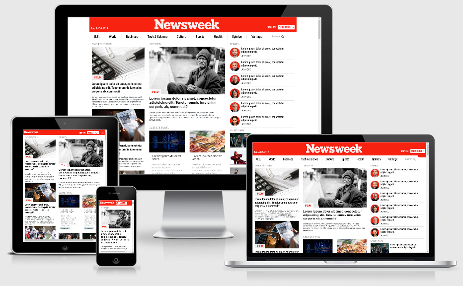

# Responsive design using CSS
###### Created by Oscar, aka. Monstruo

This project is a clone of the site [newsweek.com](https://newsweek.com/) which tries to replicate the responsive behaviour of the original site using bootstrap.

* [Live preview](https://oscarnava.github.io/newsweek-clone-using-bootstrap/)
* [Design layout diagram](https://rawcdn.githack.com/oscarnava/newsweek-clone-using-bootstrap/871a0f442ef68af33ee9f0c435c4bb41e0d50ecc/design/layout.html)

